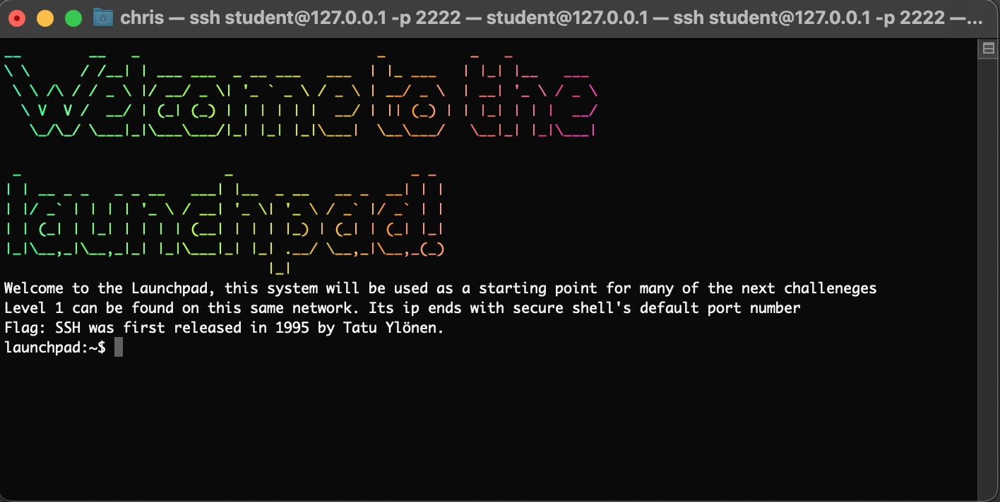

# The SSH Obstacle Course


Welcome to the SSH Obstacle Course — a fun and practical exercise designed to teach users how to navigate and use SSH effectively. It can be easily deployed on a **CFTD instance** and supports **multiple players** on the same server.

---

## Requirements

- [Docker](https://www.docker.com/)

---

## To start the game

Run as root (or a member of the docker group)
> ./s.sh

If you are on the docker host simply log into the launchpad like this
> ssh student@192.168.22.100

If you are not on the docker host then log in using the mapped port from the launchpad container
> ssh student@[docker host ip/hostname] -p 2222

If you are running this on a Mac, OSX handles container ports differently.  You'll need to use the following command
>ssh student@127.0.0.1 -p 2222



Goodluck!


## Usage

Run the setup script with optional flags:

```bash
./s.sh [-n network_name] [-o network_third_octet 192.168.x.0/24] [-p ssh_port] [-u student_username] [-w password]
```

### Example:

```bash
./s.sh -n sshfun -o 22 -p 2222 -u student -w Goodluck!
```

You can also run it without any arguments — default values will be used:

```bash
./s.sh
```

---

## Resetting the Environment

To delete and restart all containers, use:

```bash
./reset_containers.sh
```

---


